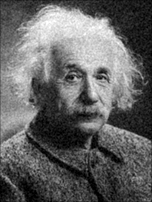
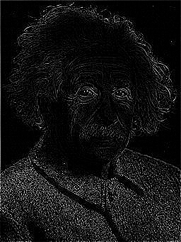
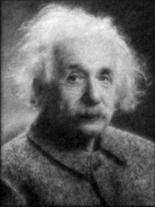

# Image Processing, Convolution, and C++ Implementation with Eigen

## Project Overview

This project demonstrates the implementation of image filtering and denoising through **convolution** operations using **C++** and the **Eigen** library. The focus is on applying filters to a grayscale image to perform tasks such as **smoothing**, **sharpening**, and **edge detection**, while also solving linear systems related to image processing.

---

## 1. Image Processing and Convolution

Image processing involves applying mathematical operations to an image, represented as a matrix of pixel values. The **convolution** operation is one of the fundamental techniques used in image processing to apply filters (also known as kernels) to an image, producing different effects like smoothing, sharpening, or edge detection.

---

## 2. Convolution Explained

**Convolution** is the process of applying a kernel matrix to an image by sliding it across the image, performing an element-wise multiplication of the overlapping elements, and summing the results. The kernel "filters" the image, creating a new image matrix where each pixel value is determined by its neighbors.

### Example: 5x5 Image and 2x2 Kernel Matrix
Let’s walk through an example of convolution using a 5x5 image matrix and a 2x2 kernel matrix.

### Step 1: Image Matrix \( F \)
The original grayscale image is represented as a 5x5 matrix \( F \), where each number corresponds to a pixel's intensity.

$$ 
F = \begin{pmatrix}
1 & 2 & 3 & 0 & 1 \\
4 & 5 & 6 & 1 & 2 \\
7 & 8 & 9 & 0 & 1 \\
2 & 3 & 4 & 2 & 0 \\
1 & 0 & 1 & 2 & 3
\end{pmatrix}
$$ 

### Step 2: Kernel Matrix \( H \)
A kernel matrix (2x2 in this example) defines the filter being applied to the image.

$$ 
H = \begin{pmatrix}
1 & 0 \\
0 & -1
\end{pmatrix}
$$ 

### Step 3: Convolution Operation
The kernel slides over the image matrix, starting from the top-left corner, performing element-wise multiplication, and summing the results.

For the top-left corner of the image:

$$ 
\begin{pmatrix}
1 & 2 \\
4 & 5
\end{pmatrix}
\quad \text{and} \quad
H = \begin{pmatrix}
1 & 0 \\
0 & -1
\end{pmatrix}
$$ 

Element-wise multiplication:

$$ 
\begin{pmatrix}
1 \cdot 1 & 2 \cdot 0 \\
4 \cdot 0 & 5 \cdot (-1)
\end{pmatrix}
= \begin{pmatrix}
1 & 0 \\
0 & -5
\end{pmatrix}
$$ 

Summing the results gives \( 1 + 0 + 0 - 5 = -4 \).

This process is repeated for each position, sliding the kernel across the image.

### Step 4: Output Matrix \( G \)
The resulting filtered image (output matrix) is smaller due to the convolution process. Here’s an example output matrix:

$$ 
G = \begin{pmatrix}
-4 & -4 & -3 & 5 \\
-2 & -2 & -5 & 0 \\
3 & 4 & -1 & -1 \\
0 & 2 & 1 & 1
\end{pmatrix}
$$ 

---

## 3. Why Numerical Linear Algebra?

Convolution operations and image processing often involve large matrices, making efficient matrix operations essential. **Numerical linear algebra** provides the tools to perform these operations effectively. In this project, the **Eigen** library is used to handle matrix and vector operations, including:

- **Matrix-Vector Multiplications**: Representing convolutions as matrix operations allows us to leverage optimized linear algebra techniques.
- **Iterative Solvers**: For more advanced denoising techniques, solving large linear systems efficiently requires iterative solvers, which are supported by the Eigen library.

---

## 4. C++ Implementation with Eigen

We use the **Eigen** library for matrix manipulation and solving linear systems. Below is an overview of the key libraries and headers used:

```cpp
#include <Eigen/Dense>     // Dense matrix operations
#include <Eigen/Sparse>    // Sparse matrix operations
#include <unsupported/Eigen/SparseExtra>  // Additional sparse matrix support
#include <cstring>         // String operations
#include <iostream>        // Standard I/O
#include <fstream>         // File operations

#define STB_IMAGE_IMPLEMENTATION
#include "headers/stb_image.h"  // Image loading
#define STB_IMAGE_WRITE_IMPLEMENTATION
#include "headers/stb_image_write.h"  // Image writing
#include "headers/filters.h"  // Custom filters
```
---

## 5. Task Descriptions

This project implements several image processing tasks using convolution operations. The key tasks are described below:

### Task 1: Loading the Image
- Load the image as an Eigen matrix with dimensions \( m \times n \). 
- Each entry in the matrix corresponds to a pixel in the image, with a value between 0 (black) and 255 (white). 
- Report the size of the matrix.
###### Output:
```
--------TASK 1----------
Image loaded: 256x341 with 1 channels.
```
### Task 2: Add Noise to the Image
- Introduce a noise signal to the loaded image by adding random fluctuations to each pixel, ranging between [-50, 50].
- Export the resulting image in `.png` format and upload it.

###### Output:
```
--------TASK 2----------
image created: results/noisy_image.png

```

### Task 3 Reshape Image as Vectors
- Reshape the original and noisy images into two vectors, \( v \) and \( w \), respectively. 
- Verify each vector should have \( m \times n \) components.
- Reshape the original and noisy images as vectors \( v \) and \( w \), respectively.
- Report the Euclidean norm of the noise vector \( e \). 

###### Output:
```
--------TASK 3----------
original width and height:87296
v mn:87296
w mn:87296
Euclidean norm of v norm: 35576.6
```
### Task 4: Apply Smoothing Filter
- Write the convolution operation corresponding to the **smoothing kernel \( H_{\text{av2}} \)**, which is a matrix-vector multiplication between the  A<sub>1</sub> (size mn x mn) image matrix and the kernel.
- The **smoothing kernel** used is:
$$
H_{\text{av2}} = \frac{1}{9} \begin{pmatrix}
1 & 1 & 1 \\
1 & 1 & 1 \\
1 & 1 & 1
\end{pmatrix}
$$
- Verify that each vector has the same number of components and report the number of non-zero entries in these vectors.


###### Output:
```
--------TASK 4----------
Number of non-zero entries in A1: 782086
```

### Task 5: Export Smoothing Filter Image
- Apply this smoothing filter to the original image  A<sub>1</sub> \( w \)  and export the resulting image. 
###### Output:
```--------TASK 5----------
image created: results/smoothed_noisy.png
```

### Task 6: Apply Sharpening Filter
- Write the convolution operation corresponding to the **sharpening kernel \( H_{\text{sh31}} \)**, which is a matrix-vector multiplication between the A<sub>2</sub> (size mn x mn)image matrix and the kernel.
- The **sharpening kernel** used is:
$$
H_{\text{sh31}} = \begin{pmatrix}
0 & -1 & 0 \\
-1 & 5 & -1 \\
0 & -1 & 0
\end{pmatrix}
$$


- Report the number  A<sub>2</sub>  of non-zero entries in the matrix 
- Is A<sub>2</sub> symmetric?

###### Output:
```
--------TASK 6----------
Number of non-zero entries in A2: 435286
Matrix A2 is not symmetric
```

### Task 7: Export Sharpening Filter Image
- Apply this sharpening filter to the original image  A<sub>2</sub> \( v \)  and export the resulting image.
```
--------TASK 7----------
image created: results/sharpened_orignal_image.png
```

### Task 8: Solving Linear Systems for Image Processing
- Export the Eigen matrix \( A_2 \) and vector \( w \) into the `.mtx` format.
- Using a suitable iterative solver and preconditioner from the **LIS** library, compute the approximate solution to the system \( A_2 x = w \), with a prescribed tolerance of \( 10^{-9} \).
- Report the iteration count and the final residual.
###### Output:
```
--------TASK 8----------
A2 matrix exported successfully to .mtx
w.mtx vector exported successfully to .mtx

number of processes = 1
matrix size = 87296 x 87296 (435286 nonzero entries)

initial vector x      : all components set to 0
precision             : double
linear solver         : BiCG
preconditioner        : ILU(0)
convergence condition : ||b-Ax||_2 <= 1.0e-09 * ||b-Ax_0||_2
matrix storage format : CSR
linear solver status  : normal end

BiCG: number of iterations = 26
BiCG:   double             = 26
BiCG:   quad               = 0
BiCG: elapsed time         = 2.721242e-01 sec.
BiCG:   preconditioner     = 1.962312e-01 sec.
BiCG:     matrix creation  = 6.710000e-07 sec.
BiCG:   linear solver      = 7.589297e-02 sec.
BiCG: relative residual    = 6.115310e-10
```


### Task 9: Export x image
- Convert the image stored in the vector \( x \)  in Eigen  `.png` image and upload it.
###### Output:
```--------TASK 9----------
image created: results/x_image.png
```
### Task 10: Edge Detection
- Apply edge detection to the image using the **Laplacian kernel \( H_{\text{app}} \)** on image matrix A<sub>3</sub> having size mn x mn.
- The **Laplacian kernel** used for edge detection is:
$$
H_{\text{app}} = \begin{pmatrix}
0 & -1 & 0 \\
-1 & 4 & -1 \\
0 & -1 & 0
\end{pmatrix}
$$

- Is A<sub>3</sub>  symmetric ?
###### Output:
```
--------TASK 10----------
Number of non-zero entries in A3: 435286
Matrix A3 is symmetric
```
### Task 11: Export Edge Detection Result
- Perform matrix-vector multiplication for edge detection and export the resulting image. A<sub>3</sub> \( v \) 
###### Output:
```
--------TASK 11----------
image created: results/edge_detection_image.png
```

### Task 11: Iterative Solver with Identity Matrix
- Using a suitable iterative solver available in **Eigen**, compute the approximate solution of the linear system \( (I + A_3)y = w \), where \( I \) denotes the identity matrix, prescribing a tolerance of \( 10^{-10} \).
- Report the iteration count and final residual.
###### Output:
```
```

### Task 12: Final Image Conversion
- Convert the image stored in the vector \( y \) into a `.png` image and upload it.
###### Output:
```
```

### Task 13: Comment on the obtained results.
- Final comments
###### Output:
```
```
## Convolution with Filters

Here our filters modify the image during the convolution process:

- **Original Image**

- **Noisy Image**

- **Smoothing Filter Applied**

- **Sharpening Filter Applied**

- **Edge Detection Filter Applied**

- **x Image**


---

## Conclusion

This project demonstrates how image processing tasks such as **smoothing**, **sharpening**, and **edge detection** can be effectively implemented using convolution operations and linear algebra methods. The **Eigen** library in C++ provides an efficient way to handle matrix operations and solve linear systems, crucial for real-time image processing applications.

---
## Credits

This was challenge  was assigned as part of the course **Numerical Linear Algebra in High-Performance Computing (2024/25)** at **Politecnico di Milano**. We extend our sincere gratitude to:

- **Professor [P. F. Antonietti](https://www.linkedin.com/in/paolaantonietti/?lipi=urn%3Ali%3Apage%3Ad_flagship3_search_srp_all%3BtoYfzDyNQUuaYhVlXkVXMQ%3D%3D)**, for providing excellent guidance throughout the course.
- **Teaching Assistant [Dott. M. Botti](https://www.linkedin.com/in/michele-botti-4707a62a2/?lipi=urn%3Ali%3Apage%3Ad_flagship3_search_srp_all%3BFvI80B0lRXiNyhRyRoR13Q%3D%3D)**, for their support and valuable feedback on this project.

This project has significantly enhanced our understanding of **numerical methods**, **image processing**, and their applications in **high-performance computing**.


## Contributors 
[Hirdesh Kumar](https://github.com/hirdeshkumar2407)

[Nadah Khaled](https://github.com/nadahkhaledd)

[Milica Sanjevic](https://github.com/milicasanjevic)


